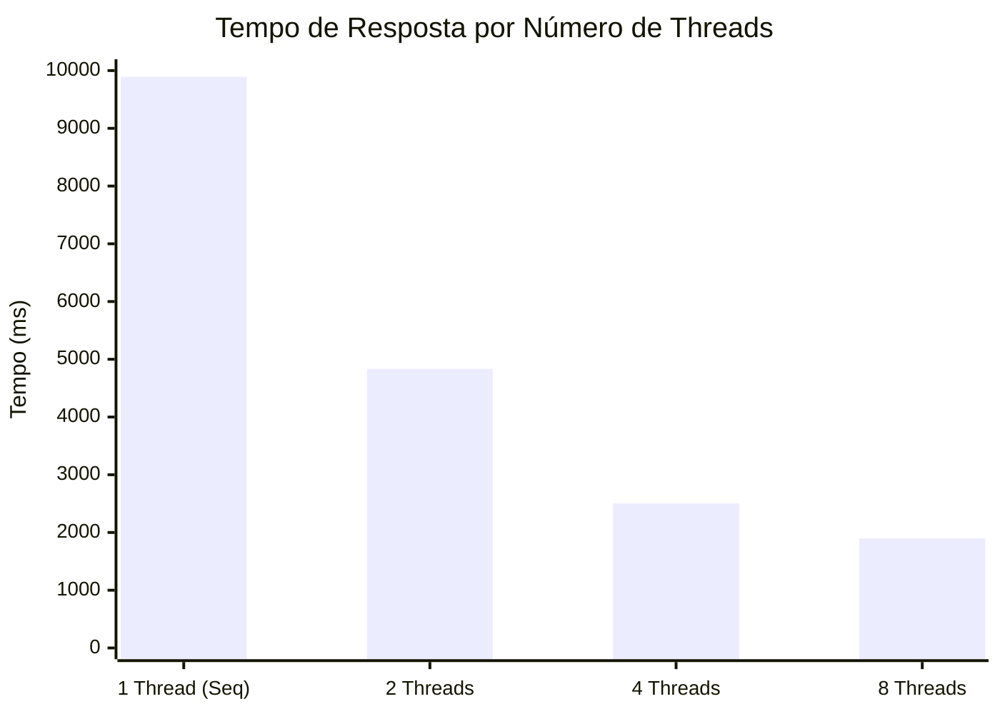

# Relatório: Paralelismo na Rota Vital

## 1. Justificativa da Operação Escolhida
A operação escolhida foi a **"Validação Cruzada de Estoque"**, que simula um processo intensivo de CPU onde cada registro passa por uma série de cálculos matemáticos pesados para validar regras de prioridade ($O(N)$ constante mas com alta carga por registro). Esta operação é ideal porque:
- O gargalo está na **CPU** (cálculos) e não na espera de Rede ou Banco de Dados (I/O).
- Os dados são perfeitamente **particionáveis**: validar a requisição do hospital A não depende da validação do hospital B, permitindo dividir a lista em fatias totalmente independentes.

## 2. Medições e Speedup
As requisições foram testadas na API local com `100.000` registros.

| Versão | Threads | Tempo de Resposta (ms) | Speedup (Ganho) |
| :--- | :--- | :--- | :--- |
| Sequencial | 1 | 9892 | 1.0x (Base) |
| Paralelo | 2 | 4835 | 2.01x |
| Paralelo | 4 | 2505 | 3.87x |
| Paralelo | 8 | 1896 | 5.28x |

### Gráfico de Tempo de Resposta vs Threads
*(Dica: Se o seu leitor de Markdown não renderizar o gráfico abaixo, você pode gerar um gráfico de barras simples no Excel com os dados da tabela acima para colocar no PDF).*

## 3. Análise Final
Analisando os resultados, observamos que o ganho de performance (speedup) foi quase linear no salto de 1 para 2 e 4 threads (atingindo 3.87x), mas deixou de ser estritamente linear ao passar para 8 threads (5.28x). Isso ocorre porque o paralelismo físico encontra seu teto no número real de núcleos do processador da máquina, passando a sofrer com *context switching* e o limite de hardware. Apesar do ganho drástico de tempo (Wall-Clock Time), a Big-O do algoritmo não mudou; a complexidade da operação matemática continua sendo $O(N)$ em relação ao tamanho da entrada, a única diferença é que fatiamos o $N$ entre múltiplos trabalhadores que operam simultaneamente. Esse cenário ilustra perfeitamente a diferença entre Concorrência e Paralelismo: enquanto na Mesa DJ (Concorrência) as threads serviam para atender eventos simultâneos independentes (ouvir o teclado do usuário enquanto a música toca, pausando estados sem travamento), aqui no Rota Vital (Paralelismo) usamos as threads unicamente para acelerar um alto volume computacional de uma mesma tarefa. Por fim, quando nem mesmo 8 ou mais threads bastarem para o Rota Vital, o limite do paralelismo vertical (na mesma máquina) terá sido atingido. Para evoluir, a arquitetura precisará adotar o Processamento Distribuído (Escalabilidade Horizontal), pulverizando essas fatias de dados entre múltiplos servidores independentes através de mensageria (Kafka/RabbitMQ) ou processamento em lote (Apache Spark).
